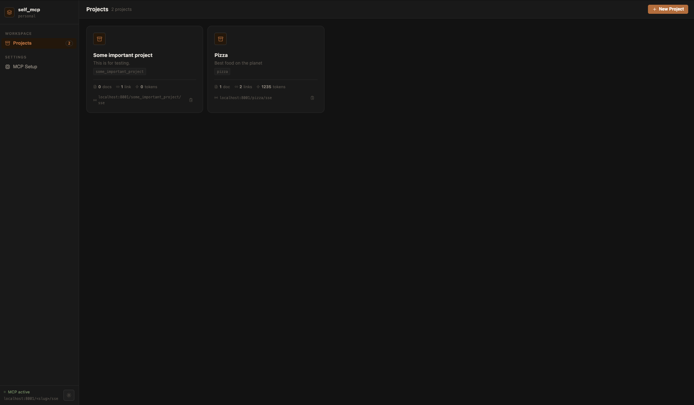
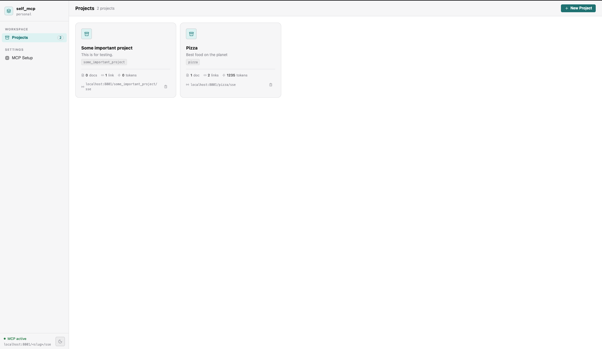

# self_mcp
MCP architecture to make sure project is the priority.

## Description

Aim us to provide the effortless environment to focus on the project rather than making sure the AI gets right information about the project.

The project allows to keep the notes about the project while notifying the tokens limit and making sure you are not hitting the dumb zone for the LLMs.

## Features

Create a standaloen MCP for your project and let the LLM take care of it when you discuss it with the agents.
Make sure you will have all the things at the same place for example your own doocuments and links for example documentations, github implementation and papers.

## How to use it?

Create an environment with python 3.11
then:

```
pip install -r requirements.txt
python start.py
```

## Preview




